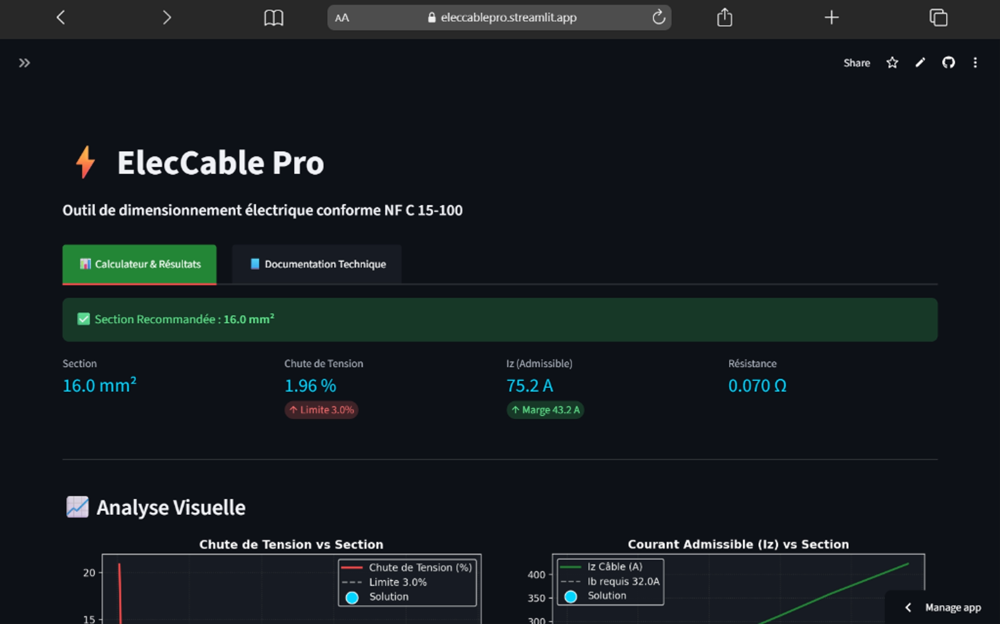
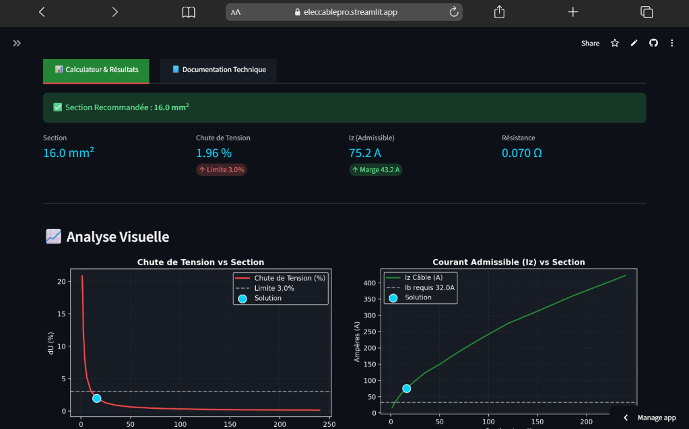
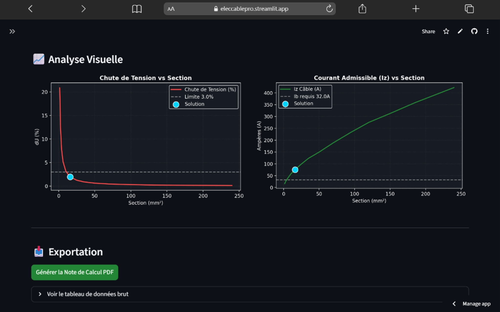
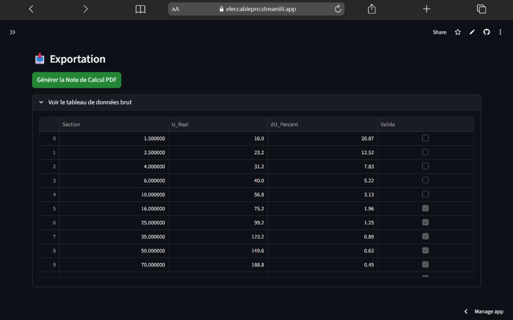
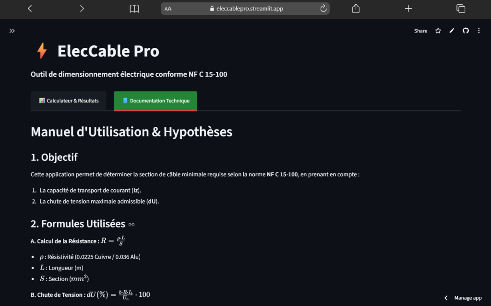
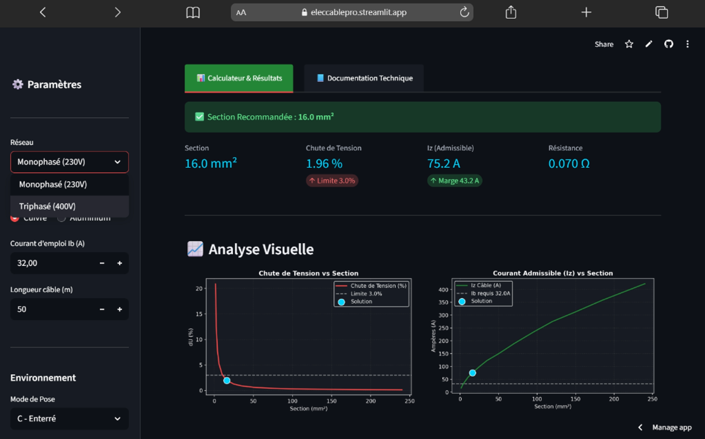

# ⚡ ElecCable Pro v2.1 | NF C 15-100

**ElecCable Pro** est une application web interactive développée avec **Python** et **Streamlit**. Elle permet aux ingénieurs et installateurs électriciens de dimensionner rapidement et avec précision les sections de câbles basse tension en respectant les exigences de la norme française **NF C 15-100**.

---

## 🚀 Fonctionnalités Clés

* **Calcul Automatisé** : Détermination de la section minimale basée sur le courant d'emploi ($I_b$) et la chute de tension maximale ($dU$).
* **Conformité NF C 15-100** : Intégration des tableaux de courants admissibles ($I_z$) et des facteurs de correction (température, mode de pose).
* **Analyse Graphique** : Visualisation dynamique de l'impact de la section sur la chute de tension et la capacité thermique du câble.
* **Rapport PDF Professionnel** : Génération instantanée d'une note de calcul exportable incluant les hypothèses, les résultats et les graphiques.
* **Interface Responsive** : Design moderne avec "Dark Mode" optimisé pour une utilisation fluide sur ordinateur et tablette.

---

## 🛠️ Installation et Utilisation Locale

### 1. Prérequis
Assurez-vous d'avoir **Python 3.8+** installé sur votre machine.

### 2. Cloner le projet
```bash
git clone https://github.com/Pemalekidev/ElecCable.git
```
### 3. Installer les dépendances
```
pip install -r requirements.txt
```
### 4.Lancer l'application
```
streamlit run main.py
```
📊 Méthodologie de CalculL'application suit un processus de vérification en deux étapes conforme aux guides de l'UTE :
### A. Condition ThermiqueOn vérifie que le courant admissible corrigé du câble ($I_z$) est supérieur au courant d'emploi ($I_b$) :
$$I_z \geq I_b$$



---


---


---



---


---



## 🚀 Fonctionnalités
- **Calcul précis** basé sur les référentiels NF C 15-100.
- **Visualisation dynamique** avec graphiques comparatifs.
- **Export professionnel** : [Télécharger un exemple de PDF](assets/Note_Calculs_32A_50m.pdf).

## 🛠️ Stack Technique
- **Backend** : Python / Streamlit
- **PDF Generation** : FPDF
- **Data** : Pandas

---
🖋️ **By Petema Maleki**
